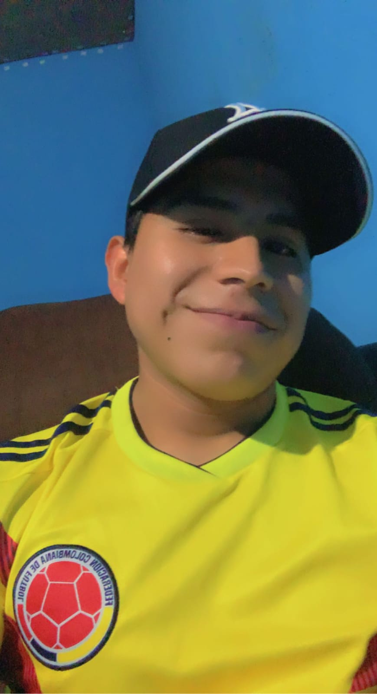

<!DOCTYPE html>
<html lang="en">
<head>
    <meta charset="UTF-8"/>
    <meta name="viewport" content="width=device-width, initial-scale=1.0"/>
    <title>Mi pagina</title>
    <link rel="stylesheet" href="estilos.css">
</head>
<body>
    

    <h1>Pedro Chic Us </h1>
    

    <h2>Estudiante de ingeniria en sistemas </h2>
    
 Soy Pedro tengo 22 anos de edad estoy cursando 3 semestre de mi carrera.   En estos momentos estoy realizando mi pagina web tengo varios 
        proyectos en mente que apenas estoy comenzando a realizar por medio de visual code usando como html y css talvez le agregue java script</script>

    
     
    <h2>Estudios Academicos</h2>
    
Tercer Semestre  Ingenieria en sistemas de informacion y ciencias de la computacion

    
Universidad Mario Galvez de Guatemala

    
     
    <h3>Habilidades</h3>
    

        Trabajo en Equipo   Responsabilidad   Participacion   Examinar   Proyectar   Mejorar 
    

    <h3> Referencias </h3>
    

        Daniela Noriega  Tel: 3295-8963  Katherine Castellano  Tel:4089-8833
    

</body>
</html>
